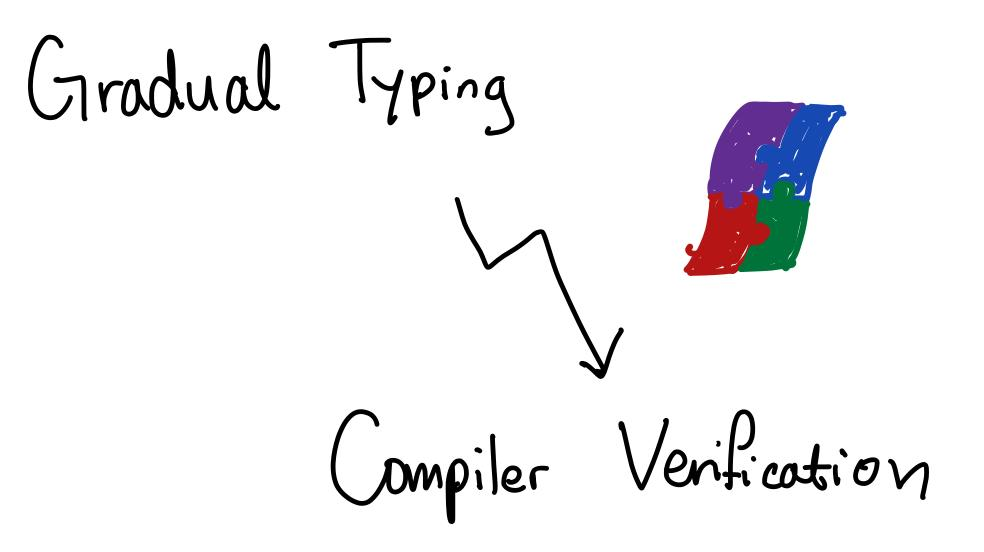

# Why Types in Compilation?

---

## Why Types in Compilation?

[Hyeyoung Shin](mailto:hyeyoungshinw@gmail.com)  
Northeastern University

Programming Languages

27 March 2019

[hyeyoungshinw@gmail.com](mailto:hyeyoungshinw@gmail.com)

---

## Add Some Slide Candy

---

## You can add images

...of your handwritten slides, for example, like this:

---

## ...or as a full slide, 

---?image=assets/img/01_gradual_compiler.jpg

---

@title[Customize Slide Layout]

@snap[west span-50]
## Customize Slide Content Layout
@snapend

@snap[east span-50]

@snapend

---

---?color=#E58537
@title[Add A Little Imagination]

@snap[north-west]
#### Add a splash of @color[cyan](**color**) and you are ready to start presenting...
@snapend

@snap[west span-55]
@ul[spaced text-white]
- You will be amazed
- What you can achieve
- *With a little imagination...*
- And **GitPitch Markdown**
@ulend
@snapend

@snap[east span-45]
@img[shadow](assets/img/conference.png)
@snapend

---?image=assets/img/presenter.jpg

@snap[north span-100 headline]
## Now It's Your Turn
@snapend

@snap[south span-100 text-06]
[Click here to jump straight into the interactive feature guides in the GitPitch Docs @fa[external-link]](https://gitpitch.com/docs/getting-started/tutorial/)
@snapend
